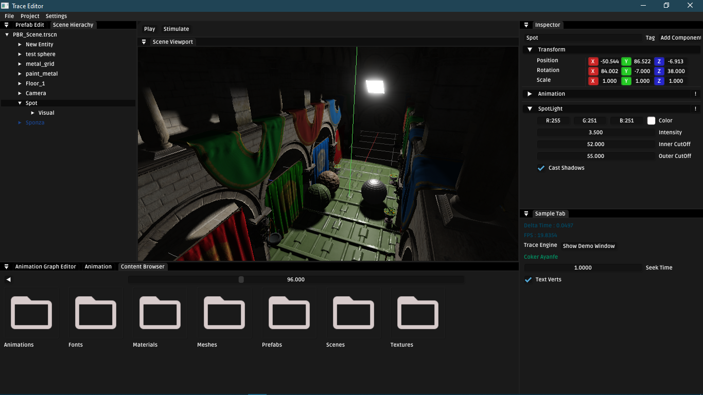
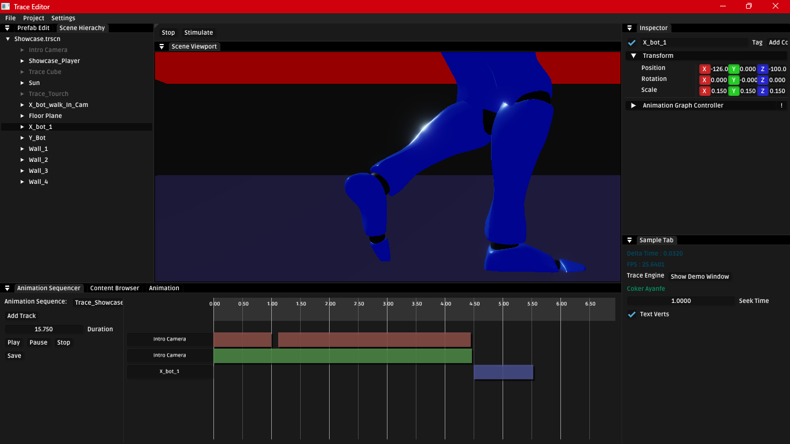
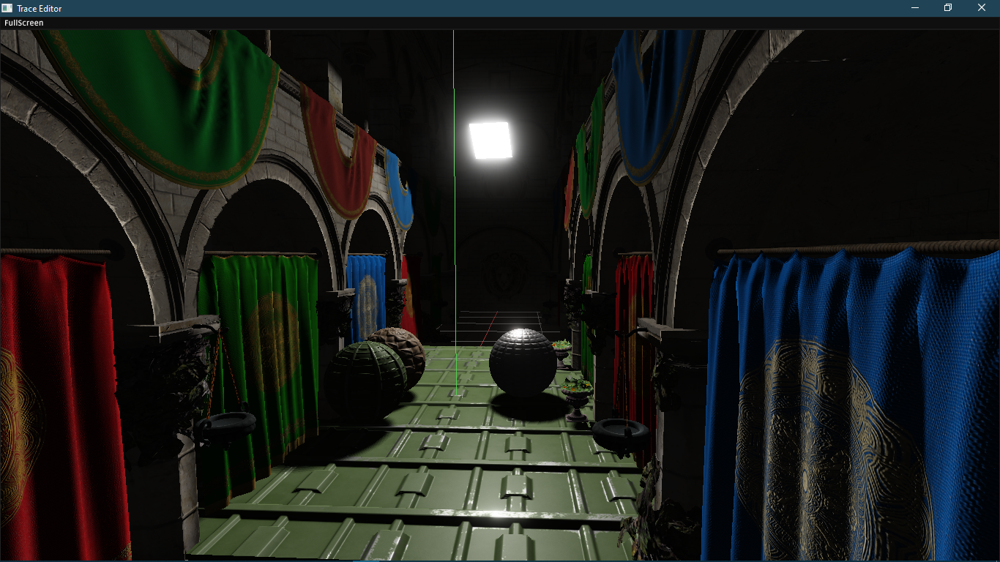
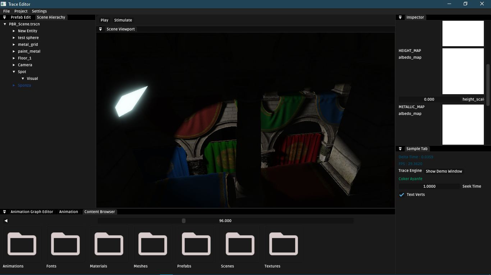

# Trace Game Engine

Trace is a game engine equiped with implementation of industry standard techniques in __(rendering, physics, gameplay systmes e.t.c)__. To be used to create games with immersive worlds and gameplay.

## Plan
To provide High Fidelity Gameplay Systems and advanced graphics to low end __PC__ in the Africa community.

## Goal
The goal is simple, it is a project that is used as learning tool, it is a software that brings high level and advanced techniques used in the game industry to a capable low end __PC__ in the Africa community

## Current Features
* Resource management
* Frame Graph
* Deferred Shading
* Physically based Bloom
* SSAO (Screen Space Ambient Occlusion)
* MSDF Text Renderering
* Animation Stuffs ( Basic retargeting, Motion Warping, Also working on Motion Matching and the likes)

## Getting Started
Follow the instructions to compile and run the engine from source
### Windows
* Install Visual Studio 2022 or newer
* Install Python and ensure it's added to PATH
* Download the [external dependencies](https://drive.google.com/file/d/1Sr5SftLc2sPyUjmdlP1Hl72r48D23346/view?usp=drive_link) and extract it to the engine root
* Run __windows_setup.bat__
* If successful open __Trace.sln__ and set __Trace_Ed__ as the startup project

`NOTE: If you have issues while running windows_setup.bat, try to install Vulkan manually and then run it again.`

## Contact Information
For any inquiries or questions, please contact at <cokerayanfe@gmail.com>. Would love to hear your opinions and any help/contribution would be really appreciated

#Images

